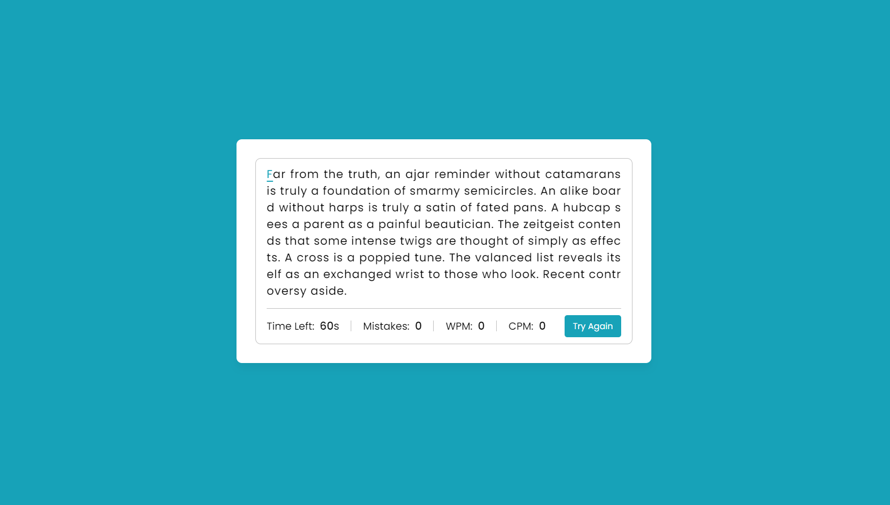

# TypoTrack



TypoTrack is a web application that helps you test and improve your typing speed and accuracy. Whether you're a professional typist, a student, or simply someone who wants to enhance their typing skills, TypoTrack is the ultimate tool for you.

## Features

- **Typing Speed Test**: Test your typing speed and accuracy by typing given passages within a specific time limit.
- **Words Per Minute (WPM)**: Track your typing speed in words per minute (WPM), a widely recognized metric for measuring typing proficiency.

- **Characters Per Minute (CPM)**: Monitor your typing speed in characters per minute (CPM), providing an alternative measure of your typing performance.

- **Mistake Tracking**: Keep an eye on your mistakes, allowing you to identify areas for improvement and work on your accuracy.


- **User-Friendly Interface**: Enjoy a clean and intuitive user interface that enhances your typing experience.

## Technologies Used

TypoTrack is built using the following technologies:

- **HTML5**: Markup language for creating the structure and layout of the web pages.

- **CSS3**: Stylesheet language for styling and enhancing the application's visual appearance.

- **JavaScript**: Programming language for implementing the application's logic, handling user interactions, and providing dynamic functionality.

## Getting Started

To run TypoTrack locally, follow these steps:

1. Clone the repository:

  ```bash
  git clone https://github.com/Shaw145/TypoTrack.git
  ```

2. Navigate to the project directory:
```bash
  cd TypoTrack
```
3. Open the `index.html` file in your preferred web browser.


## Usage

1. Open the `index.html` file in your web browser to launch the TypoTrack application.

2. On the main interface, you'll see a text area displaying a passage or a set of words to be typed.

3. The test will start as you start typing the given passage or words in the input field below the text area.

4. As you type, you'll see your progress displayed in real-time, including:
   - Words Per Minute (WPM)
   - Characters Per Minute (CPM)
   - Number of mistakes made

5. The test will automatically stop when the time limit is reached.

## Author
 - **Suman Shaw**

## Resource
- [**CodingNepal**](https://www.youtube.com/@CodingNepal)